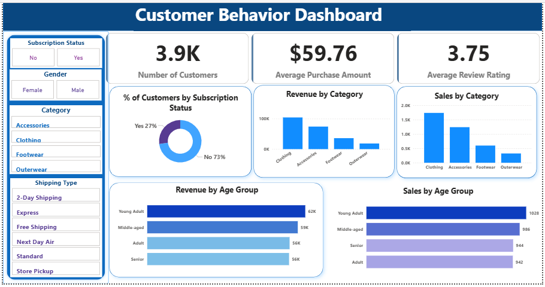
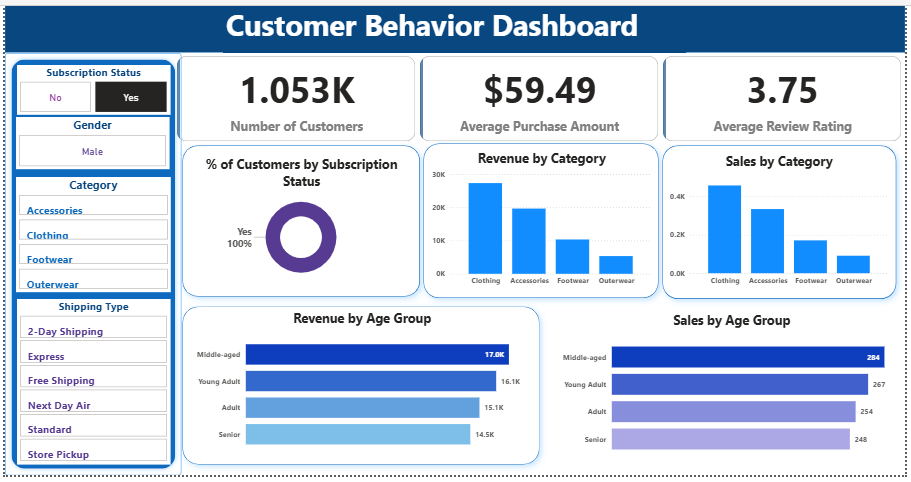
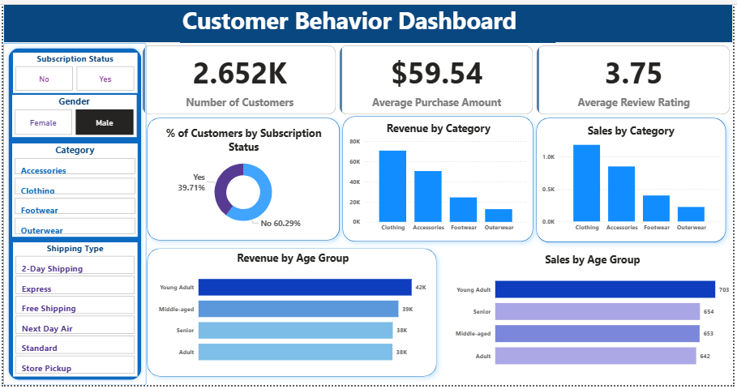
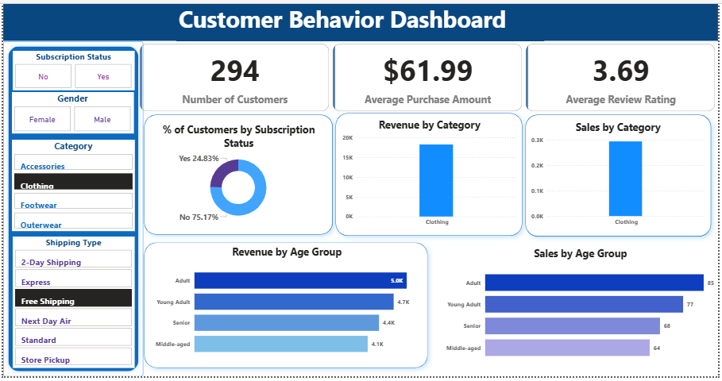

# Customer Behavior Analysis Project

## Project Overview

This project analyzes customer shopping behavior using SQL, Python, and Power BI. The objective is to identify purchasing patterns, customer preferences, and business insights that can support data-driven decision-making.

## Dataset Description

The dataset contains customer shopping transactions, including:

* Customer demographics
* Product categories
* Purchase amounts
* Shopping frequency
* Payment methods
* Customer ratings

## Tools & Technologies

* Python (Pandas, NumPy, Matplotlib)
* SQL
* Power BI
* Jupyter Notebook

## Project Workflow

### 1. Data Cleaning and Analysis (Python)

* Loaded and explored the dataset
* Handled missing values
* Performed exploratory data analysis (EDA)
* Generated visualizations to identify trends and patterns

### 2. SQL Analysis

* Wrote SQL queries to analyze customer purchasing behavior
* Calculated sales metrics
* Identified top-performing categories
* Examined customer spending patterns

### 3. Power BI Dashboard

Developed an interactive dashboard to visualize:

* Total Sales
* Customer Demographics
* Product Performance
* Purchase Trends
* Customer Segmentation

## Key Insights

* Customers in specific age groups contributed the highest revenue.
* Certain product categories generated significantly higher sales.
* Purchase behavior varied across customer segments.
* Seasonal trends influenced customer spending patterns.

## Files Included

* Customer_Shopping_Behavior_Analysis_python.ipynb
* Customer_Behavior_SQL.sql
* Customer_Behavior_Dashboard.pbix
* customer_shopping_behavior_data.csv
* Customer_Behavior_Report.pdf

## Dashboard Preview

